# 🛡️ AegisOps AI — Autonomous SRE & Incident Remediation Platform


> **AegisOps AI** is an enterprise-grade autonomous Site Reliability Engineering (SRE) platform that unites real-time telemetry simulation, machine learning anomaly detection, predictive risk modeling, multi-agent AI incident investigation, RAG knowledge retrieval, human-in-the-loop remediation, and interactive topology/time-travel observability.

---

## 🚀 End-to-End Autonomous Incident Lifecycle

```mermaid
flowchart LR
    A[Telemetry Stream] --> B[ML Anomaly Detection]
    B --> C[Incident Trigger]
    C --> D[Multi-Agent AI Investigation]
    D --> E[RAG Knowledge Retrieval]
    E --> F[Root Cause & Incident DNA]
    F --> G[Blast Radius & Risk Evaluation]
    G --> H[Human SRE Approval]
    H --> I[Remediation Execution]
    I --> J[Telemetry Verification]
    J --> K[Automated SRE Postmortem]
```



1. **Telemetry & Observability**: Continuous ingestion across 8 microservices (CPU, Memory, Latency p50/p95/p99, Error Rates, RPS, DB Connections, Queue Depth).
2. **ML Anomaly Detection**: Isolation Forest + EWMA rolling Z-score fusion with multi-signal severity normalization.
3. **Incident Creation**: Correlates alerts and clusters related anomalies into unified incidents.
4. **AI Investigation**: Multi-agent orchestration (Planner, Investigator, Root Cause, Knowledge, Risk, Remediation, and Report agents).
5. **RAG Knowledge Base**: Vector similarity search matching active symptoms to operational runbooks and past incident resolutions.
6. **Incident DNA Fingerprinting**: Extracts normalized 8-dimensional feature vector signatures and matches historical incident patterns via cosine similarity.
7. **Blast Radius & Risk Engine**: Calculates downstream cascade impact zone, affected user count, and estimated financial loss per minute.
8. **Human-in-the-Loop Remediation**: SREs review remediation proposals, safety tiers, and risk scores before granting cryptographic execution approval.
9. **Automated Verification**: Re-samples telemetry metrics post-remediation to prove system stabilization.
10. **Google-SRE Postmortem**: Automatically synthesizes executive postmortem markdown reports with timeline, root cause, trigger, and action items.

---

## ✨ Standout Capabilities

| Feature | Description |
|---|---|
| 🗺️ **Live Service Topology Map** | Interactive topology graph with real-time health indicators, latency p95, error rates, and dependency edges. |
| ⏪ **Time-Travel Infrastructure Debugger** | Scrubbable timeline with replay capability across metrics and logs at any minute prior to or during an incident. |
| 💥 **Blast Radius & Financial Impact** | Real-time calculation of downstream service cascade, affected users, and revenue loss rate ($/min). |
| 📊 **AI Confidence Calibration** | Real-time calibration curve and Brier score tracking ($0.082$ overall) ensuring calibrated AI confidence. |
| 🧬 **Incident DNA Fingerprinting** | Cosine similarity matching against historical incident vector signatures to accelerate root-cause discovery. |
| 🗣️ **NL2Metrics Query Bar** | Plain English query translation to SQL/PromQL and live telemetry charts (e.g., *"Show payment service latency"*). |
| 🛡️ **AI Security & Guardrails** | Prompt injection defense, sandboxed tool execution, JWT authentication, and tamper-evident audit logging. |
| 🕹️ **Chaos & Fault Injection Suite** | 8 injectable real-world scenarios: DB connection exhaustion, memory leaks, CPU spikes, latency storms, and cascading failures. |

---

## 🏛️ System Architecture

```
d:\Aegisops Ai\
├── backend/                  # FastAPI 0.110+ Asynchronous Python Backend
│   ├── app/
│   │   ├── api/              # Modular API Routers (34 REST endpoints)
│   │   │   ├── auth.py       # JWT Authentication & RBAC
│   │   │   ├── health.py     # System Liveness & Health
│   │   │   ├── telemetry.py  # Live Telemetry, Metrics, Logs, Time-Travel
│   │   │   ├── incidents.py  # Incident Lifecycle & Remediation Approvals
│   │   │   ├── services_router.py # Services & Topology Map
│   │   │   ├── ai.py         # AI Copilot, NL2Metrics, Calibration
│   │   │   ├── simulation.py # Chaos Injection & Simulator Controls
│   │   │   ├── knowledge.py  # RAG Document Ingestion & Search
│   │   │   ├── security.py   # Guardrails & Audit Logs
│   │   │   └── evaluation.py # Model Benchmarks & RCA Accuracy
│   │   ├── core/             # Configuration, Logging, Security
│   │   ├── db/               # Async & Sync SQLAlchemy Engines, Migrations
│   │   ├── models/           # 16 Relational SQLAlchemy Entities
│   │   ├── schemas/          # Pydantic v2 Request/Response Schemas
│   │   └── services/         # Core ML, LLM, Agents, RAG & Simulation
│   │       ├── agents/       # Multi-Agent Orchestrator
│   │       ├── ml_engine.py  # Isolation Forest & Incident DNA
│   │       ├── llm_service.py # DeepSeek & Deterministic Fallback LLM
│   │       ├── rag/          # Vector Store & Semantic Runbook Search
│   │       ├── nl2metrics.py # Natural Language to Metrics Translator
│   │       └── simulator.py  # 8-Microservice High-Fidelity Simulator
│   ├── tests/                # Comprehensive Pytest Suite (Unit + Integration)
│   └── Dockerfile            # Containerized Python 3.10 Backend
├── frontend/                 # Next.js 14 App Router Frontend (TypeScript)
│   ├── src/
│   │   ├── app/              # Cybernetic Dark-Theme Pages
│   │   │   ├── dashboard/    # Main Command Center
│   │   │   ├── incidents/    # Incident List & [id] Deep Investigation View
│   │   │   ├── services/     # Service Catalog & [id] Telemetry Inspection
│   │   │   ├── topology/     # Service Dependency & Blast Radius Map
│   │   │   ├── time-travel/  # Historical Timeline Scrubber
│   │   │   ├── ai-copilot/   # Conversational Ops Copilot & NL2Metrics
│   │   │   ├── knowledge/    # Runbook Ingestion & Semantic Search
│   │   │   ├── security/     # Security Guardrail Monitor & Audit Trail
│   │   │   ├── evaluation/   # Benchmark Matrix & Calibration Curves
│   │   │   └── simulations/  # Chaos Fault Injection Center
│   │   ├── components/       # Reusable UI & Chart Components
│   │   └── lib/              # Typed API Client & Utilities
│   └── Dockerfile            # Multi-stage Optimized Production Build
├── docs/                     # Architecture, Guides, ML Specs, Interview Q&As
├── alembic/                  # Database Migrations
└── docker-compose.yml        # Full-Stack Multi-Container Orchestration
```

---

## ⚡ Quick Start (Local Development)

### 1. Prerequisites
- **Python**: 3.10 or 3.11
- **Node.js**: 18+ or 20+
- **Git**

### 2. Backend Setup
```bash
# Clone repository
git clone https://github.com/your-org/aegisops-ai.git
cd "Aegisops Ai"

# Activate Python Virtual Environment
# Windows:
.\venv\Scripts\activate
# Linux/macOS:
source venv/bin/activate

# Install dependencies (if not already installed)
pip install -r backend/requirements.txt

# Run Database Migrations
alembic upgrade head

# Start FastAPI Backend Server
python -m uvicorn app.main:app --host 0.0.0.0 --port 8000 --app-dir backend --reload
```
The backend will be available at:
- **API Base**: `http://127.0.0.1:8000/api`
- **Interactive Swagger UI**: `http://127.0.0.1:8000/docs`
- **ReDoc**: `http://127.0.0.1:8000/redoc`

### 3. Frontend Setup
In a new terminal:
```bash
cd "Aegisops Ai/frontend"

# Install dependencies
npm install

# Start Next.js Development Server
npm run dev
```
Open **`http://localhost:3000`** in your browser to access the AegisOps AI Command Center.

---

## 🐳 Docker Deployment

To spin up the complete production-grade stack including Backend, Frontend, PostgreSQL, and Redis:

```bash
# From project root
docker-compose up --build -d
```

| Service | Host Port | Internal Container Port |
|---|---|---|
| **Frontend UI** | `3000` | `3000` |
| **FastAPI Backend** | `8000` | `8000` |
| **PostgreSQL DB** | `5432` | `5432` |
| **Redis Cache** | `6379` | `6379` |

To stop services:
```bash
docker-compose down
```

---

## 🧪 Testing & Verification

### Backend Pytest Suite
Run the full unit and integration test suite:
```bash
.\venv\Scripts\pytest.exe -v
```
**Tests include:**
- Health & readiness endpoints
- Microservice catalog & dynamic topology graph
- Telemetry summary, rolling metrics, and time-travel replay
- End-to-end incident lifecycle: demo launch → 6-step AI investigation → remediation approval → verification → postmortem
- AI Copilot conversation & prompt-injection security guardrails
- NL2Metrics query parsing & chart generation
- ML Isolation Forest anomaly detection & z-score baselining
- Incident DNA vector fingerprinting & cosine similarity
- 30-minute predictive risk degradation horizon
- Calibration & evaluation benchmark matrix

### Frontend Validation
```bash
cd frontend

# TypeScript strict type checking
npx tsc --noEmit

# Production bundle build verification
npm run build
```

---

## 🔐 Default Demo Accounts

| Role | Email | Password | Permissions |
|---|---|---|---|
| **Admin** | `admin@aegisops.io` | `admin123` | Full access, Chaos Injection, Remediation Approval |
| **Operator / SRE** | `operator@aegisops.io` | `operator123` | Remediation Approval, Incident Investigation |
| **Viewer** | `viewer@aegisops.io` | `viewer123` | Read-only telemetry, topology, and dashboards |

---

## 📜 License

Distributed under the Apache 2.0 License. See `LICENSE` for more information.
