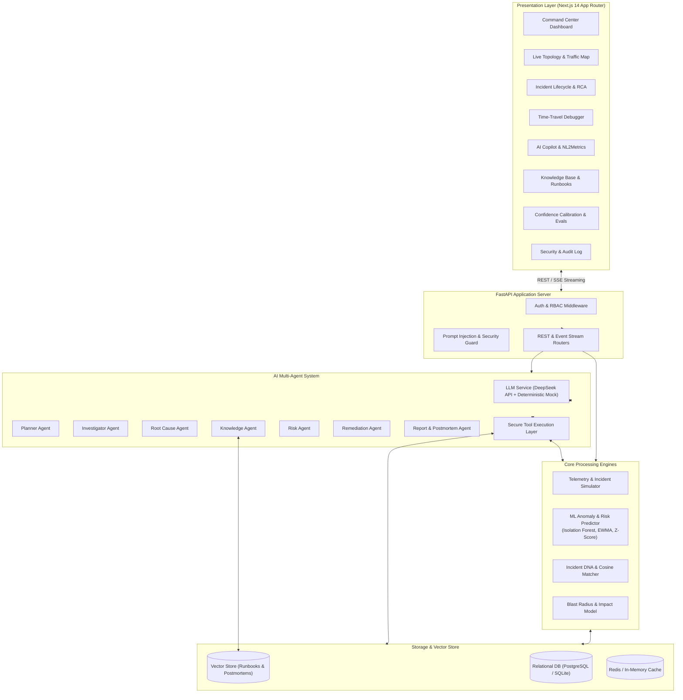
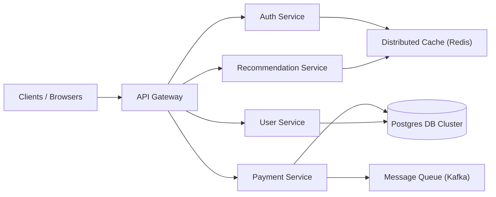
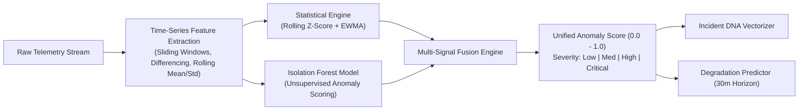
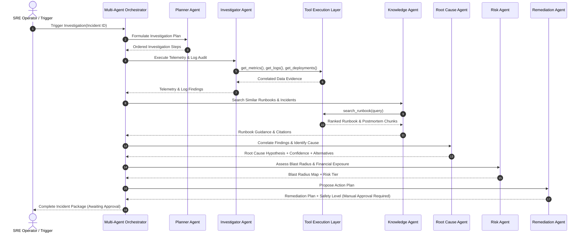
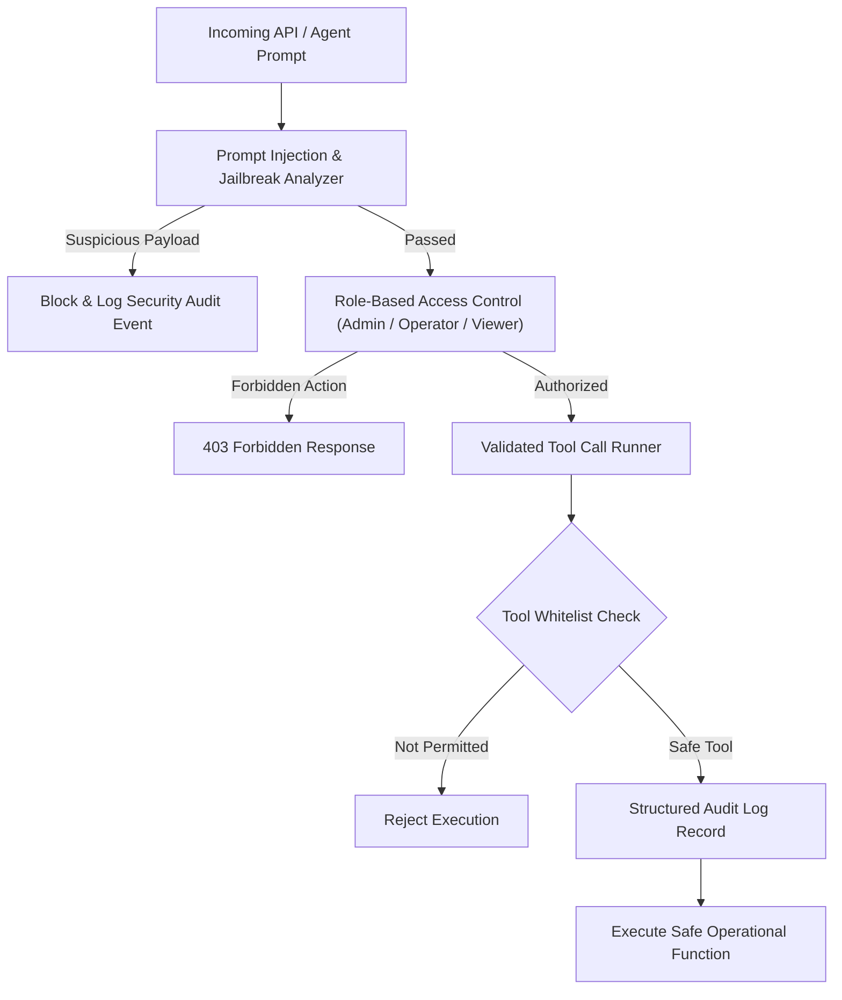

# AegisOps AI — System Architecture & Design

## 1. System Overview

AegisOps AI is an autonomous AI operations platform designed for site reliability engineers (SREs), DevOps teams, and platform operators. It bridges real-time telemetry observation, statistical/machine-learning anomaly detection, multi-agent AI root cause investigation, automated blast radius analysis, and human-in-the-loop remediation.

---

## 2. Microservice Topology & Synthetic Infrastructure

AegisOps AI monitors a simulated distributed e-commerce / fintech microservices mesh:

Each service emits:
- **Metrics**: CPU utilization (%), Memory (MB & %), Request Throughput (req/s), Latency (p50, p95, p99 in ms), Error Rate (%), Database Connection Pool Saturation (%), Queue Depth.
- **Logs**: High-velocity structured JSON logs containing timestamp, service, level (`DEBUG`, `INFO`, `WARN`, `ERROR`, `FATAL`), trace ID, request path, and message payload.
- **Deployments**: Version release tags, commit hashes, configuration changes, and rollback points.

---

## 3. Machine Learning & Anomaly Detection Pipeline

1. **Statistical Baseline**: Computes dynamic bounds using Exponential Weighted Moving Averages (EWMA) and rolling 3-sigma thresholds.
2. **Isolation Forest**: Identifies multidimensional metric anomalies (e.g., normal CPU + normal requests, but anomalous latency and connection ratio).
3. **Anomaly Fusion**: Normalizes metrics into a composite risk score:
   $$\text{Score} = w_{\text{lat}} S_{\text{lat}} + w_{\text{err}} S_{\text{err}} + w_{\text{conn}} S_{\text{conn}} + w_{\text{cpu}} S_{\text{cpu}}$$
4. **Incident DNA**: Extracts an 8-dimensional normalized fingerprint vector based on metric deltas and maps it against known incident clusters via cosine distance.

---

## 4. Multi-Agent AI Orchestration Architecture

---

## 5. Security Architecture & AI Guardrails

- **Deterministic Fallback**: If DeepSeek API is offline, throttled, or without credentials, an enterprise-grade deterministic rule engine activates seamlessly so 100% of workflows execute reliably.
- **Safety Tiers**:
  - `LOW_RISK`: Automated simulated actions (cache warm-up, scale replicas by 1).
  - `MEDIUM_RISK`: Human confirmation recommended.
  - `HIGH_RISK` / `CRITICAL`: Strictly gated behind cryptographic operator signature / UI approval button.

---

## 6. Standout Innovations

1. **Live Service Topology Map**: Real-time canvas/SVG node rendering with animated traffic particles flowing along edges, dynamically recolored based on latency and error conditions.
2. **Time-Travel Infrastructure Debugger**: Timeline scrubbing mechanism that allows operators to review historical metric snapshots, log streams, and system topology states at any second $T_{-n}$.
3. **Blast Radius & Financial Impact Engine**: Graph traversal identifying downstream service dependencies and computing estimated financial loss ($\$ / \text{min}$) based on active user volume.
4. **AI Confidence Calibration Dashboard**: Tracks reliability curves and Brier score across agent predictions to prevent overconfidence in production recommendations.
5. **Automated Google-SRE Postmortem Generator**: Auto-assembles markdown postmortems adhering to Google SRE guidelines upon incident resolution.
6. **Incident DNA Fingerprinting**: Vectorized anomaly signature matching linking active outages to historical resolution runbooks with cosine similarity percentages.
7. **NL2Metrics Query Engine**: Natural language input translated into dynamic time-series charts directly inside the AI Copilot.
