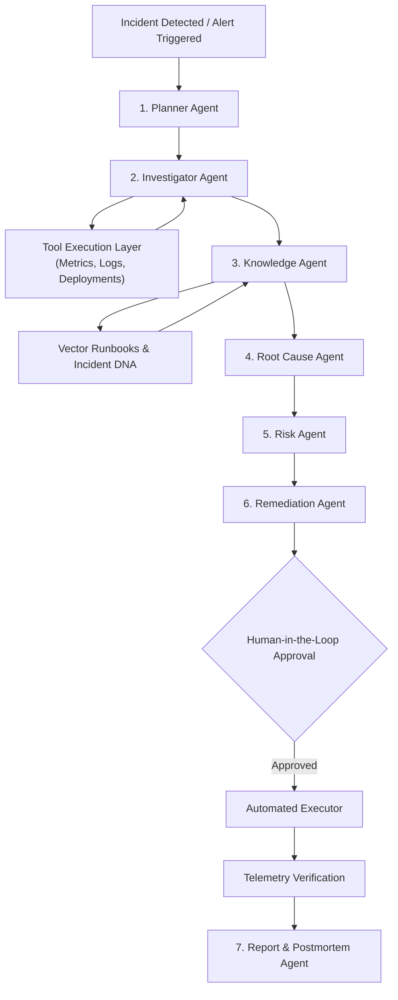

# AegisOps AI — Multi-Agent System Architecture

## 1. Multi-Agent Philosophy

In high-reliability enterprise operations, autonomous systems must not be monolithic prompts or decorative chatbot wrappers. AegisOps AI divides operational responsibility among 7 specialized, deterministic agents governed by strict execution boundaries.

---

## 2. Agent Specifications

### 1. Planner Agent
- **Responsibility**: Converts unformatted alert signals into an ordered 6-step investigation plan.
- **Input**: `Incident ID`, `Service Name`, `Initial Trigger Symptom`.
- **Output Schema**: JSON object with sequenced investigation tasks.

### 2. Investigator Agent
- **Responsibility**: Queries observability tools to isolate anomalies.
- **Tools Invoked**:
  - `get_service_health(service_name)`
  - `get_metrics(service_name, metric_name, time_range)`
  - `get_logs(service_name, severity, limit)`
  - `get_recent_deployments(service_name)`
- **Output Schema**: Correlated empirical evidence array with confidence weights.

### 3. Knowledge Agent
- **Responsibility**: Queries RAG operational runbooks and matches Incident DNA signatures.
- **Tools Invoked**:
  - `search_runbook(query)`
  - `match_incident_dna(signature_vector)`
- **Output Schema**: Ranked runbook procedures with relevance percentages and historical matches.

### 4. Root Cause Agent
- **Responsibility**: Synthesizes evidence, assigns calibrated confidence scores, and documents counter-hypotheses.
- **Output Schema**: Primary fault diagnosis, calibrated confidence score [0.0 - 1.0], and alternative hypotheses with rejection rationale.

### 5. Risk Agent
- **Responsibility**: Traverses microservice dependency topology to compute blast radius, affected users, and revenue loss per minute.
- **Tools Invoked**:
  - `calculate_blast_radius(service_name)`
- **Output Schema**: Impact zone list, active user count, and financial exposure rate.

### 6. Remediation Agent
- **Responsibility**: Formulates operational recovery plan with required safety tier.
- **Safety Tiers**:
  - `LOW`: Simulated auto-remediation.
  - `MEDIUM` / `HIGH`: Strictly requires human operator approval via UI.
- **Output Schema**: Action type, target service, execution parameters, and verification criteria.

### 7. Report Agent
- **Responsibility**: Upon remediation verification, auto-drafts a Google SRE-compliant postmortem document.
- **Output**: Structured markdown postmortem including executive summary, timeline, what went well/wrong, and action items.

---

## 3. Safety Guardrails & Limits
- **Max Steps**: Capped at 8 steps per investigation run.
- **Max Tool Calls**: Capped at 15 calls per run.
- **Isolation**: Arbitrary shell execution (`bash`, `sh`, `cmd`, `powershell`) is strictly forbidden.
