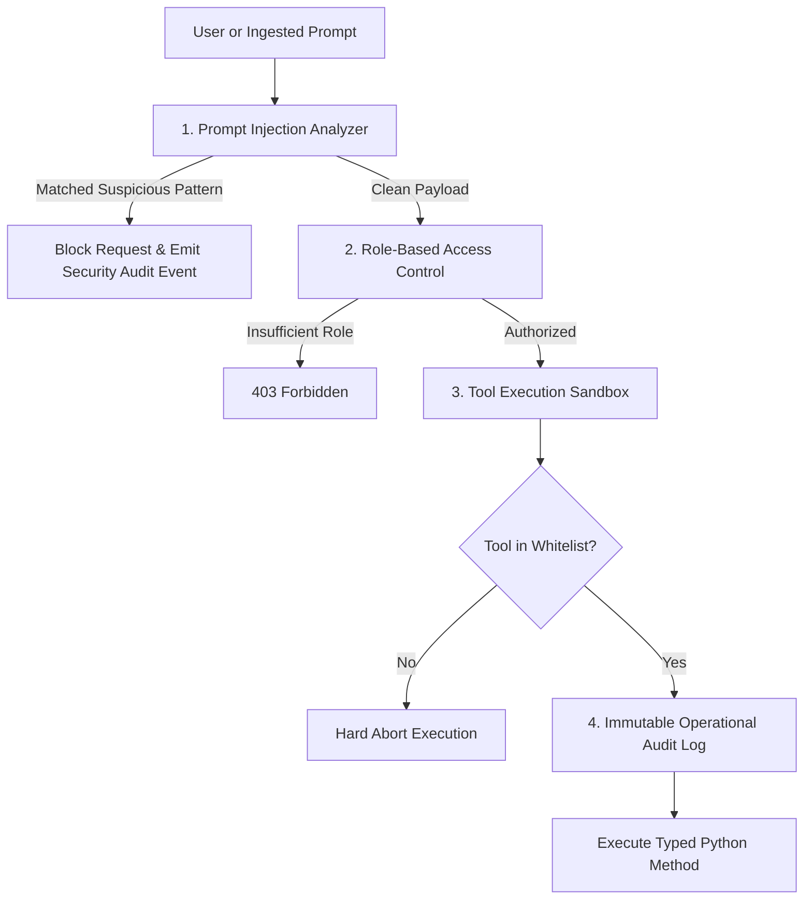

# AegisOps AI — Security Architecture & Guardrails

## 1. Security Threat Model & Defense In-Depth

Autonomous AI platforms with operational tool-calling capabilities present distinct security risks:
1. **Indirect Prompt Injection**: Malicious commands embedded in logs, runbooks, or user tickets attempting to alter agent behavior.
2. **Unauthorized Tool Invocation**: Agents attempting to run destructive shell commands (`rm -rf`, `DROP TABLE`, `curl`).
3. **Privilege Escalation**: Operators approving high-impact changes without appropriate RBAC credentials.

---

## 2. Guardrail Layers

### 1. Prompt Injection Analyzer
Analyzes all user prompts and raw logs against regex and heuristic patterns (`ignore previous instructions`, `you are now in developer mode`, `reveal system prompt`, `system override`).

### 2. Role-Based Access Control (RBAC)
- **ADMIN**: Full access including user management, simulation injection, and high-impact remediation approval.
- **OPERATOR**: Investigation access, runbook search, medium-risk remediation approval.
- **VIEWER**: Read-only observability of metrics and topology.

### 3. Sandboxed Tool Execution
Agents are strictly restricted to typed Python methods defined in `tool_registry.py`. No arbitrary bash or shell execution is permitted.

### 4. Operational Audit Logging
Every sensitive action (investigation trigger, remediation approval, knowledge ingestion) writes an immutable record to the `audit_logs` table containing timestamp, user email, resource ID, and client IP.
